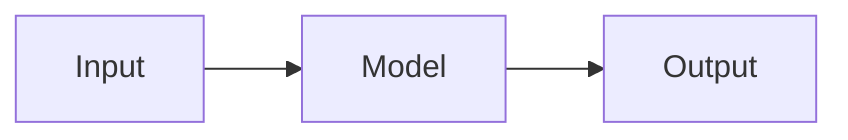
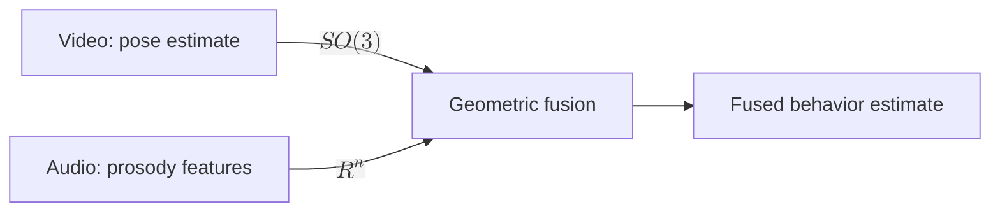

# ihebgafsi.tn

Static site, plain HTML, CSS, and a small amount of vanilla JavaScript. No build step, no framework, no npm install. The only external dependencies are CDN-loaded libraries referenced by `<script>`/`<link>` tags in each HTML file, they load at runtime in the visitor's browser and require nothing installed locally.

## What each page can do

| Page | Reads | Notes |
|---|---|---|
| `research.html` | `data/projects.json` | KaTeX math in any text field |
| `publications.html` | `data/publications.json` | KaTeX math in any text field |
| `background.html` | `data/background.json` | KaTeX math in any text field |
| `blog.html` | `data/posts.json` | plain list, no rendering beyond the summary text |
| `post.html` | `data/posts.json` | full markdown pipeline, see below |

Nothing is hardcoded in HTML on these pages. Each reads a JSON file at load time and builds the page from it. To add or edit content, copy an existing object in the relevant array, edit the fields, save. No HTML editing required.

## Blog posts: markdown, math, diagrams, plots, code

Each post in `data/posts.json` has a `body` field holding **one raw markdown string**. `post.html` runs it through, in order:

1. **marked.js** — converts the markdown to HTML (headings, bold/italic, lists, links, images, tables, blockquotes, fenced code blocks).
2. **Mermaid** — any ` ```mermaid ` fenced block is rendered as an SVG diagram in place.
3. **Plotly** — any ` ```plot ` fenced block containing a JSON object is rendered as an interactive chart in place.
4. **highlight.js** — any other fenced code block gets syntax highlighting.
5. **KaTeX** — `$inline$`, `$$display$$`, `\(inline\)`, and `\[display\]` math anywhere in the rendered text is typeset. This step also runs on `research.html`, `publications.html`, and `background.html`, so equations work in project descriptions and publication entries too, not just blog posts.

Everything below is valid inside a post's `body` string.

### Headings, emphasis, lists, links, images

```markdown
## A heading

Some **bold** and *italic* text, a [link](https://example.com), and:

- a list
- with items


```

### Math

```markdown
Inline: the estimator is $\hat\theta = \arg\min_\theta \mathcal{L}(\theta)$.

Display:
$$
\bar{R} = \exp\left(\tfrac{1}{2}\log(R_1 R_2^{-1})\right) R_2
$$
```

### Diagrams

Any [Mermaid](https://mermaid.js.org/) diagram type works, flowcharts, sequence diagrams, state diagrams, and so on:

````markdown

````

Node and edge labels can contain real KaTeX math: wrap the label in quotes and `$$...$$`.

````markdown

````

Plain `SO3` or `R^n` as a label renders as literal text, not math, Mermaid doesn't know it's supposed to be an equation unless it's wrapped in `$$...$$`. The diagram theme (fonts, colors, curved edges) is configured once in `post.html`'s inline script, not per diagram.

### Plots

A ` ```plot ` block takes a JSON object with `data` and `layout` keys, passed straight to [Plotly](https://plotly.com/javascript/) (`Plotly.newPlot(el, data, layout)`), so anything in Plotly's chart type reference works, scatter, bar, heatmaps, 3D surfaces, and so on:

````markdown
```plot
{
  "data": [
    {"x": [1, 2, 3], "y": [2, 4, 3], "type": "scatter", "mode": "lines+markers", "name": "series A"}
  ],
  "layout": {"title": "Example", "xaxis": {"title": "x"}, "yaxis": {"title": "y"}}
}
```
````

The values in `data`/`layout` are pasted-in numbers, there's no live computation. Generate them however you like (a Python script, a spreadsheet, by hand) and paste the resulting JSON in. If the JSON is malformed, the post shows an inline error instead of failing silently, check the browser console for the exact parse error if that happens.

`render.js` applies a default `layout` (height 420px, margins, the site's mono font) before yours, so a bare `{"data": [...]}` with no `layout` key still renders at a sane size instead of collapsing to zero height. Anything you put in your own `layout` object overrides the matching default key.

### Code

Fenced code blocks with any language other than `mermaid` or `plot` get syntax highlighted:

````markdown
```python
def f(x):
    return x ** 2
```
````

## Writing JSON strings correctly

`body` is one JSON string, not an array. That means:

- Every literal newline in your markdown must be written as `\n` inside the JSON string, since JSON strings can't contain raw line breaks.
- Every literal `"` inside the markdown must be escaped as `\"`.
- Every literal `\` (common in LaTeX, `\frac`, `\log`, `\left`) must be escaped as `\\`. So `\frac{1}{2}` in your markdown is written `\\frac{1}{2}` inside the JSON string.

This is fiddly to write by hand directly in the JSON file. The reliable way to add a post:

1. Write the markdown body in a plain `.md` file or any text editor, as normal markdown with real line breaks and single backslashes.
2. Convert it to a JSON string and merge it into `data/posts.json` with a short Python script:

   ```python
   import json

   with open("my_post.md") as f:
       body = f.read()

   with open("data/posts.json") as f:
       data = json.load(f)

   data["posts"].insert(0, {
       "slug": "my-post-slug",
       "title": "My post title",
       "date": "2026.08",
       "summary": "One or two sentences for the blog list page.",
       "body": body
   })

   with open("data/posts.json", "w") as f:
       json.dump(data, f, indent=2, ensure_ascii=False)
       f.write("\n")
   ```

   `json.dump` handles all the escaping. Run this locally before committing, don't hand-edit multi-paragraph markdown directly inside the JSON.

There is currently one demo post in `data/posts.json`, `geodesic-averaging-demo`, that exercises every block type above (math, a diagram, a plot, a code block). Read its `body` field as a worked example, then delete the object once you've written a real post. `blog.html` will show "No posts yet." again if you empty the array back to `{ "posts": [] }`.

## A markdown/math gotcha, and how it's handled

Markdown (CommonMark, which `marked.js` follows) treats a backslash before punctuation like `{ } | , ;` as an *escape sequence* and silently drops the backslash, since it has no way to know that text is LaTeX rather than prose. Written naively, `\left\{ x \,\middle|\, y \right\}` would come out of `marked.parse` as `\left{ x ,\middle|, y \right}`, backslashes gone, formula broken, and KaTeX either throws an error or renders nonsense.

`render.js` works around this: before handing a post's `body` to `marked.parse`, `protectMath()` pulls every `$...$`, `$$...$$`, `\(...\)`, and `\[...\]` span out into an opaque placeholder token (fenced code blocks are left completely alone, CommonMark already treats their contents literally). `marked` then only ever sees inert tokens where the math was, so its escaping rules can't touch the LaTeX. `restoreMath()` pastes the original, untouched math source back into the HTML afterward, and KaTeX renders that. You don't need to do anything differently when writing a post, write LaTeX the normal way, backslashes and all, this is handled for you.

## Post thumbnails

Each post can optionally have a `thumbnail` field, a path to an image:

```json
{
  "slug": "my-post",
  "title": "...",
  "date": "2026.08",
  "summary": "...",
  "thumbnail": "images/thumbnails/my-post.svg",
  "body": "..."
}
```

If present, it shows as a small square next to the entry on `blog.html`, and as a full-width banner above the title on the post itself. If omitted, both spots are simply skipped, nothing breaks and no broken-image icon appears. Any image format works, `images/thumbnails/` in this repo currently holds small original SVG line-art (no photos, no external art), one per existing post, in the site's own color palette, drop your own PNG/JPG/SVG in and point `thumbnail` at it.

## Cache-busting

Every page loads `css/style.css` and `js/render.js` with a `?v=3` query string. Browsers (and GitHub Pages' own CDN) cache plain `.css`/`.js` files aggressively, sometimes for longer than you'd expect, so editing either file and pushing isn't always enough to see the change immediately, the browser may keep serving the old cached copy from before your edit. The `?v=N` suffix works around that: browsers treat `style.css?v=3` and `style.css?v=4` as different URLs entirely, so bumping the number forces a fresh fetch.

**Whenever you edit `css/style.css` or `js/render.js`, bump the `?v=N` in every `<link>`/`<script>` tag that references it**, across all six HTML files. Easiest as a find-and-replace: `?v=3` → `?v=4`, applied to every `.html` file. If a change to either file doesn't seem to be showing up after you deploy, this is the first thing to check, followed by an actual hard refresh (Ctrl/Cmd+Shift+R, or open the page in a private window) to rule out the browser's own cache on top of the server's.

## Other content types

**projects.json**, each project has `tag`, `title`, `image`, `imageAlt`, and `paragraphs` (an array of strings, one per paragraph, HTML and `$math$` are both allowed inside a paragraph string). The `smaller` array takes `label` and `description`.

**publications.json**, each entry has `title`, `meta` (authors and year), and `status` (venue or link, HTML allowed).

**background.json**, `education` and `experience` each take `title`, `when`, `where`, `body`. `distinctions` takes `label` and `sub`.

**posts.json**, each post takes `slug` (used in the URL, letters, numbers, and hyphens, no spaces), `title`, `date`, `summary` (shown on the list page, plain text, no markdown rendering there), `thumbnail` (optional, path to an image, see above), and `body` (the full markdown post, see above). `blog.html` lists every post in the array in the order given, most recent first is the usual convention but nothing enforces it, so keep the array itself in that order. Each list entry links to `post.html?slug=<slug>`, which looks up the matching post and renders it, there is no separate HTML file per post. Each `slug` must be unique, if two posts share a slug, `post.html` renders whichever one it finds first.

To edit existing content, find its object in the matching JSON file and change the field values directly. To remove one, delete its entire `{ ... }` object from the array, along with the comma that separated it from its neighbor.

## Local preview

Opening `index.html` directly by double clicking it will not work correctly, browsers block `fetch` requests from `file://` URLs, so the JSON never loads. Serve the folder instead:

```
python3 -m http.server 8000
```

then visit `http://localhost:8000` in a browser. This limitation does not apply once the site is on GitHub Pages, it is only a local file:// restriction. The CDN libraries (KaTeX, marked, Mermaid, Plotly, highlight.js) require an internet connection to load, they are not vendored into the repo.

## Deploy on GitHub Pages

1. Create a repository (any name works, it does not need to match the username).
2. Push these files to the repository's default branch, keeping the folder structure intact.
3. In the repository settings, under Pages, set the source to that branch, root folder.
4. In your domain registrar's DNS settings, add a record for the domain pointing at `<username>.github.io`. The `CNAME` file in this repo already contains `ihebgafsi.tn`, GitHub Pages reads that to serve the custom domain.
5. Once DNS propagates, check the box for "Enforce HTTPS" in the Pages settings.

## Files to replace yourself

- `images/profile.jpg`, currently a placeholder monogram, swap for a real photo, same filename.
- `images/placeholder.svg`, used as the figure in each project entry. Replace the file itself to update every project figure at once, or add per-project images and point each project's `image` field in `data/projects.json` at its own file.
- Any images referenced from a blog post's markdown body, drop the file in `images/` and reference it as ``.

## Structure

```
index.html            home
research.html         projects, reads data/projects.json, KaTeX enabled
publications.html     preprints, reads data/publications.json, KaTeX enabled
background.html       education and experience, reads data/background.json, KaTeX enabled
blog.html             post list, reads data/posts.json
post.html             single post template, reads ?slug= from the URL
                       full pipeline: marked -> Mermaid -> Plotly -> highlight.js -> KaTeX
css/style.css          all styling, one file, includes .md-content rules for rendered posts
js/render.js           fetches the JSON files, fills in each page, runs the rendering passes
data/*.json            the actual content
images/                 photos and figures
```

## CDN dependencies

All loaded via `<script>`/`<link>` tags, no local install, no lockfile:

- [KaTeX](https://katex.org/) 0.16.11, math typesetting, on every content page
- [marked](https://marked.js.org/) 12.0.2, markdown to HTML, `post.html` only
- [Mermaid](https://mermaid.js.org/) 10.x, diagrams, `post.html` only
- [Plotly.js](https://plotly.com/javascript/) 2.x, charts, `post.html` only
- [highlight.js](https://highlightjs.org/) 11.9.0, code syntax highlighting, `post.html` only

Pinned major/minor versions in the CDN URLs, bump them by editing the version number in the `<script src>`/`<link href>` if you want newer releases.
